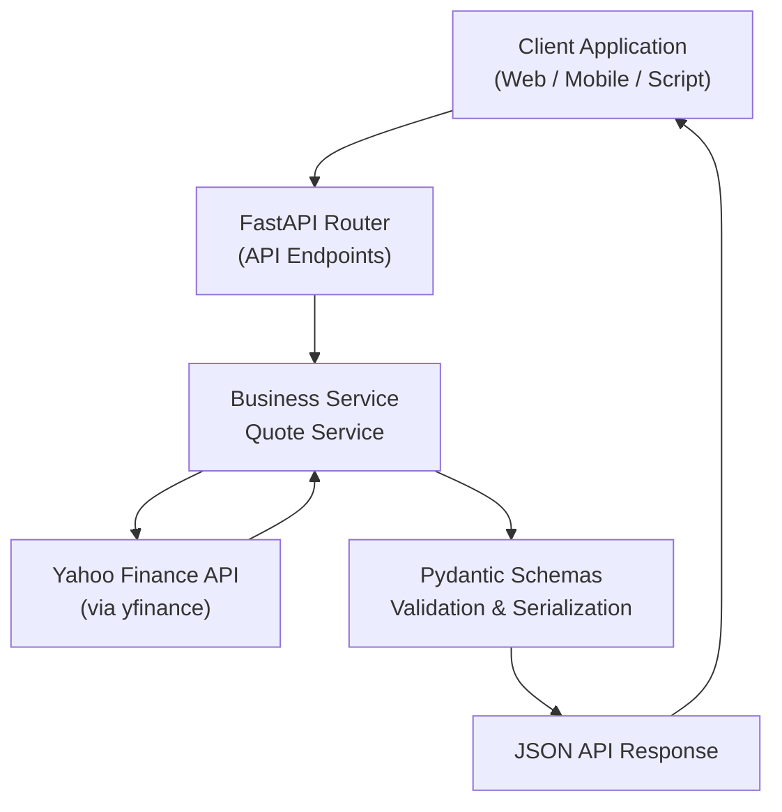

# 📈 FastB3 API

A modern, high-performance **RESTful API** for retrieving stock quotes from **B3 (Brazilian Stock Exchange)**.

Built with **Python and FastAPI**, FastB3 works as a **financial microservice** that consumes market data, processes relevant information, and returns a standardized, typed, and validated JSON payload.

[](https://fastapi.tiangolo.com)
[](https://python.org)
[](https://docker.com)

---

# 📌 Description

The **FastB3 API** simplifies access to stock market data for companies traded on the Brazilian stock exchange (B3).

It acts as an intermediary layer that:

* fetches market data via **Yahoo Finance**
* standardizes the information
* calculates relevant metrics
* returns structured JSON responses

The API is designed to be used in:

* financial applications
* market dashboards
* investment analysis systems
* financial data microservices

---

# ✨ Features

* 📊 **Real-time stock quotes**
* 🔎 **Support for any B3 ticker**
* ➕ **Automatic `.SA` suffix handling**
* 📉 **Absolute and percentage change calculations**
* 🔢 **Financial precision using `Decimal`**
* 🧾 **Typed responses with Pydantic**
* ⚠️ **Robust error handling**
* 🐳 **Docker-ready deployment**

---

# 🛠 Technologies

| Technology       | Description                           |
| ---------------- | ------------------------------------- |
| **Python 3.10+** | Main programming language             |
| **FastAPI**      | Modern high-performance web framework |
| **Uvicorn**      | ASGI server                           |
| **Pydantic**     | Data validation and serialization     |
| **yfinance**     | Market data provider                  |
| **pytest**       | Testing framework                     |
| **Docker**       | Application containerization          |

---

# 🏗 Architecture

The **FastB3 API** follows a **Layered Architecture** to ensure separation of concerns, testability, and maintainability.

Request flow:

1. The client sends an HTTP request
2. The **Router** receives the endpoint call
3. The **Service** executes the business logic
4. **yfinance** fetches data from Yahoo Finance
5. Data is normalized by **Schemas**
6. A JSON response is returned to the client

---

## Architecture Diagram



---

# ⚙️ Installation

## Prerequisites

* Python **3.10+**
* pip
* Docker (optional)

---

## Local Installation

Clone the repository:

```bash
git clone https://github.com/herikerbeth/fastb3-api.git
cd fastb3
```

Create a virtual environment:

```bash
python -m venv venv
source venv/bin/activate
```

Install dependencies:

```bash
pip install -r requirements.txt
```

Run the application:

```bash
uvicorn app.main:app --reload
```

---

## Running with Docker

Build the image:

```bash
docker build -t fastb3-api .
```

Run the container:

```bash
docker run -p 8000:8000 fastb3-api
```

---

# 📖 API Usage

Once the application is running, access the interactive FastAPI documentation:

```
http://localhost:8000/docs
```

---

## Endpoints

### `GET /`

API health check.

**Response**

```json
{
  "message": "Welcome to FastB3 API"
}
```

---

### `GET /stock/{ticker}`

Retrieves the stock quote for a B3-listed company.

**Parameter**

| Name   | Type   | Description                      |
| ------ | ------ | -------------------------------- |
| ticker | string | Stock symbol (e.g. PETR4, VALE3) |

**Example**

```bash
curl http://localhost:8000/stock/PETR4
```

---

### Example Response

```json
{
  "global_quote": {
    "symbol": "PETR4.SA",
    "open_price": "43.2500",
    "high": "44.2700",
    "low": "43.0100",
    "price": "43.9000",
    "volume": 47876000,
    "latest_trading_day": "2026-03-09",
    "previous_close": "42.1100",
    "change": "1.7900",
    "change_percent": "4.2508"
  }
}
```

---

# 📊 Data Model

| Field              | Type    | Description            |
| ------------------ | ------- | ---------------------- |
| symbol             | string  | Stock ticker           |
| open_price         | decimal | Opening price          |
| high               | decimal | Daily high             |
| low                | decimal | Daily low              |
| price              | decimal | Current price          |
| volume             | integer | Trading volume         |
| latest_trading_day | date    | Last trading day       |
| previous_close     | decimal | Previous closing price |
| change             | decimal | Absolute change        |
| change_percent     | decimal | Percentage change      |

---

# 🧪 Tests

The project includes **unit and integration tests** using `pytest`.

Run all tests:

```bash
pytest
```

Run with coverage:

```bash
pytest --cov=app tests/
```

---

# 📁 Project Structure

```
fastb3/
│
├── app/
│   ├── main.py
│   │
│   ├── routers/
│   │   └── quote_router.py
│   │
│   ├── services/
│   │   └── quote_service.py
│   │
│   └── schemas/
│       └── quote_schema.py
│
├── tests/
│   ├── unit/
│   └── integration/
│
├── requirements.txt
├── Dockerfile
├── pytest.ini
└── README.md
```

---

# ⚙️ Technical Details

### Financial Precision

All monetary values use `Decimal` with **4 decimal places** to avoid common floating-point rounding errors.

### B3 Convention

Brazilian tickers automatically receive the suffix:

```
.SA
```

Example:

```
PETR4 → PETR4.SA
```

---

# 🤝 Contributing

Contributions are welcome.

1. Fork the repository
2. Create a branch

```
git checkout -b feature/my-feature
```

3. Commit your changes

```
git commit -m "Add new feature"
```

4. Push to the branch

```
git push origin feature/my-feature
```

5. Open a Pull Request

---

# ⚠️ Disclaimer

This project uses data from **Yahoo Finance** and **is not affiliated with B3 (Brasil Bolsa Balcão)**.